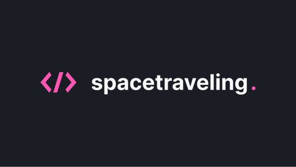

  <h1>:rocket: SpaceTraveling  </h1>
  <h2>Ignite React Track Challenge</h2>
  
Challenge proposed in the React track of Rocketseat's Ignite. In this challenge, we were asked to develop an application from scratch following the content provided to us in chapter 3.

  
The functionalities developed were: comments section, navigation between posts, information on whether the post was updated after its creation, and a post preview system where the content creator can see how the post will look on the application's page before publishing it.

## Technologies

- [TypeScript](https://www.typescriptlang.org/)
- [Next.js](https://nextjs.org/)
- [Prismic](https://prismic.io/)
- [Figma](https://www.figma.com/)
- [Sass](https://sass-lang.com/)
- [date-fns](https://date-fns.org/docs/Getting-Started)
- [Fetch_API](https://developer.mozilla.org/pt-BR/docs/Web/API/Fetch_API/Using_Fetch)
- [react-icons](https://react-icons.github.io/react-icons/)
- [Utterances](https://utteranc.es/)

## Proposed Activities

- [x] Comments with Utteranc;
- [x] Prismic document preview;
- [x] Navigation between previous and next posts;
- [x] Information about post edition.

## Giving feedback

Feedback is always welcome, if you have any suggestions or questions please send me an email: gcgonzalez99@hotmail.com
